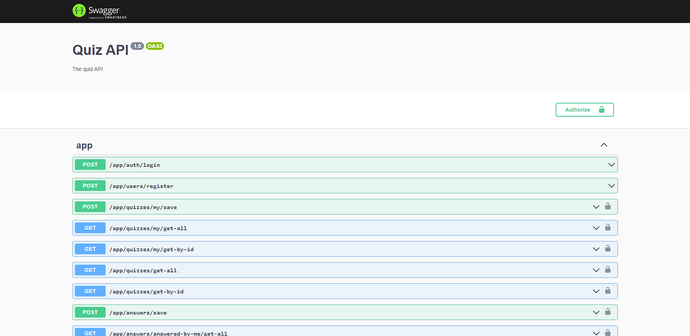

# Neutralize Quiz

This is a Q&A service between users.

## Dependencies

- [NodeJs](https://nodejs.org/en/)
- [NestJs](https://nestjs.com/)
- [Docker](https://docs.docker.com/)
- [PowerShell Core](https://docs.microsoft.com/pt-br/powershell/scripting/install/installing-powershell?view=powershell-7.1)

## For deploy on docker

Go to the `docker` folder and run up.ps1 script with *PowerShell Core*

```pwsh
cd docker
pwsh -File up.ps1
```

You can access the url. You must see see some image like this.



## Tests

Now you can run the tests with the following command

```pwsh
test:e2e
```

You will see something output

```
> neutralize-quiz@0.0.1 test:e2e /home/mauricio/repos/github/neutralize-quiz
> jest --config ./test/jest-e2e.json

 PASS  test/app.e2e-spec.ts
  AppController (e2e)
    √ (POST) /app/quizzes/my/save (30 ms)
    √ (GET) /app/quizzes/my/get-all (7 ms)
    √ (GET) /app/quizzes/my/get-by-id (20 ms)
    √ (GET) /app/quizzes/get-all (63 ms)
    √ (GET) /app/quizzes/get-by-id (66 ms)
    √ (POST) /app/answers/save (83 ms)
    √ (GET) /app/answers/answered-by-me/get-all (69 ms)
    √ (GET) /app/answers/answered-by-me/get-by-id (64 ms)
    √ (GET) /app/answers/asked-by-user/get-all (57 ms)
    √ (GET) /app/answers/asked-by-user/get-by-id (62 ms)

Test Suites: 1 passed, 1 total
Tests:       10 passed, 10 total
Snapshots:   0 total
Time:        4.518 s, estimated 5 s
```